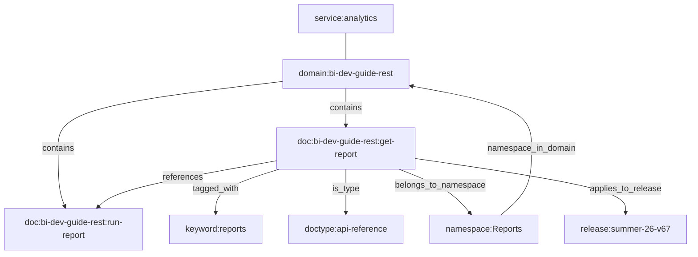

# Knowledge Graph Schema

The SF Documentation Knowledge Graph connects 53,000+ nodes and 450,000+ edges across all 121 Salesforce documentation domains.

## Node Types

| Type | Count | Description |
|---|---|---|
| `document` | 30,429 | A single documentation page (topic) |
| `keyword` | 22,610 | A significant concept extracted from document content |
| `namespace` | 143 | An Apex namespace (e.g., `System`, `ConnectApi`, `Database`) |
| `domain` | 121 | A documentation domain (e.g., `apex-reference`, `rest-api`) |
| `service` | 19 | A Salesforce service category (e.g., `analytics`, `commerce`) |
| `doctype` | 6 | A document classification (`api-reference`, `developer-guide`, `concept`, etc.) |
| `release` | 1 | A Salesforce release version |
| `api_version` | 1 | An API version |

## Edge Types

| Type | Count | Source → Target | Purpose |
|---|---|---|---|
| `tagged_with` | 273,890 | document → keyword | Document is about this concept |
| `references` | 52,988 | document → document | Cross-references between docs |
| `is_type` | 30,679 | document → doctype | Document classification |
| `contains` | 30,429 | domain → document | Domain contains this doc |
| `applies_to_release` | 30,429 | document → release | Doc applies to this release |
| `requires_api` | 30,429 | document → api_version | Doc requires this API version |
| `belongs_to_namespace` | 1,262 | document → namespace | Doc belongs to this Apex namespace |
| `namespace_in_domain` | 216 | namespace → domain | Namespace exists in this domain |
| `belongs_to_service` | 121 | domain → service | Domain belongs to this service category |

## Node ID Conventions

```
domain:<domain-id>              → domain:apex-reference
doc:<domain>:<topic>            → doc:apex-reference:apex_methods_system_string
keyword:<normalized-term>       → keyword:soql
namespace:<name>                → namespace:System
service:<category>              → service:analytics
doctype:<type>                  → doctype:api-reference
release:<version>               → release:summer-26-v67
api_version:<version>           → api_version:67.0
```

## Graph Structure



## Querying the Graph

### Programmatic (TypeScript)

```typescript
import { GraphQuery } from "./src/utils/graph-query.js";

const gq = new GraphQuery();
await gq.load();

// Search for documents
gq.searchNodes("SOQL queries");

// Find related docs via cross-references
gq.findRelated("doc:apex-reference:apex_methods_system_string");

// Browse an Apex namespace
gq.findByNamespace("System");

// Explore a service category
gq.findByService("analytics");

// Get full context for a document
gq.getDocContext("doc:rest-api:intro_rest_resources");
```

### CLI

```bash
npm run graph:stats
```

### MCP Server

Connect via Claude Desktop and use tools:
- `sf_search` — search across all domains
- `sf_graph_query` — navigate the graph
- `sf_apex_lookup` — look up Apex classes
